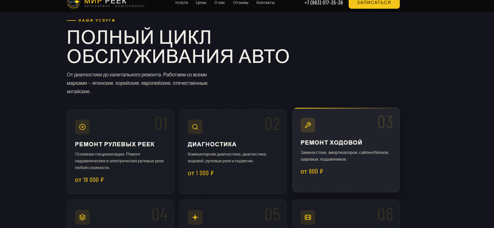
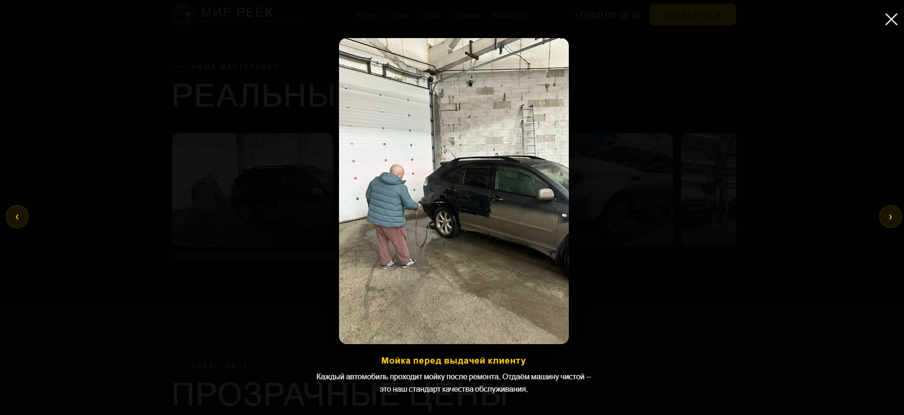
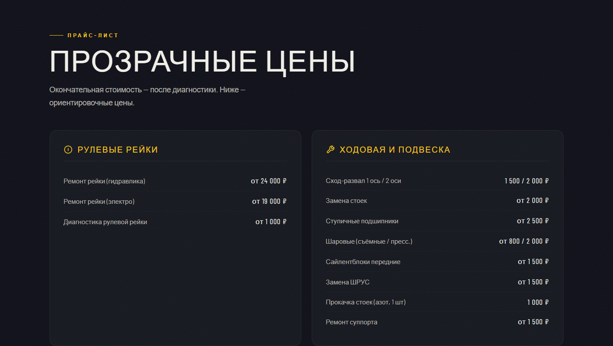
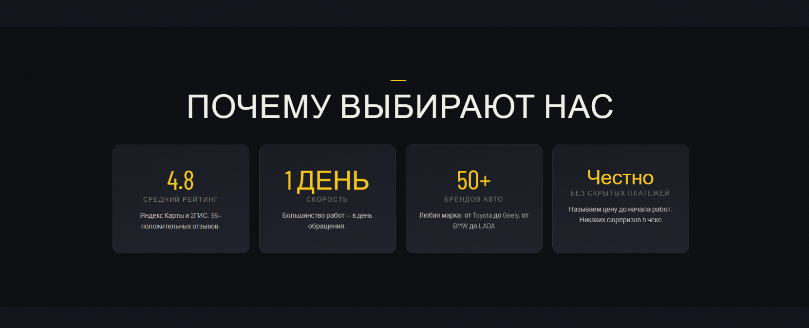
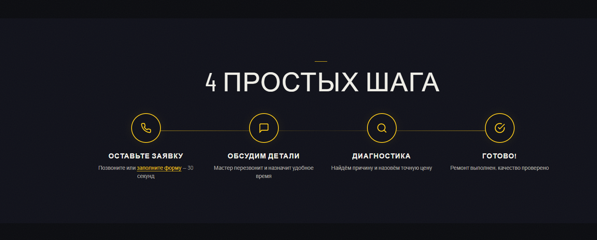
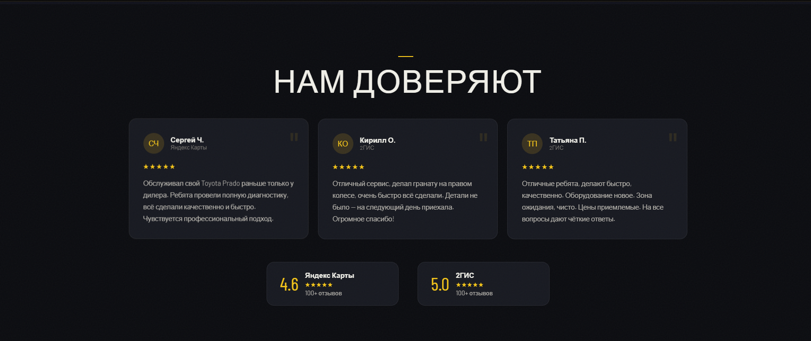
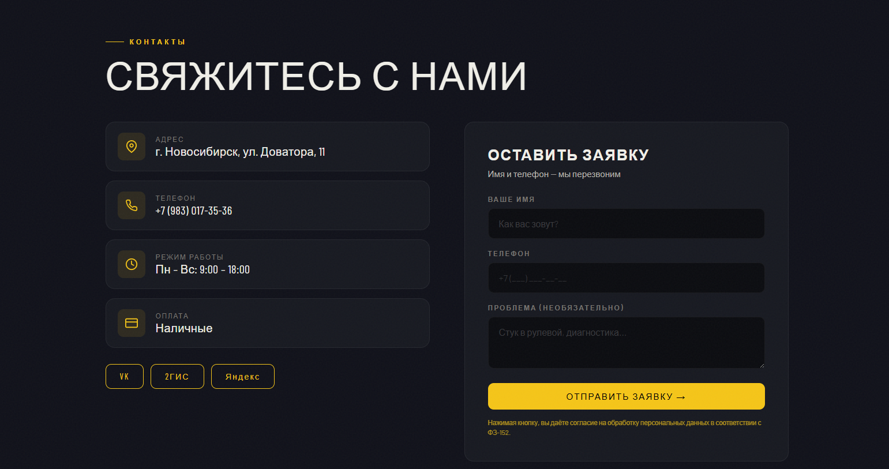
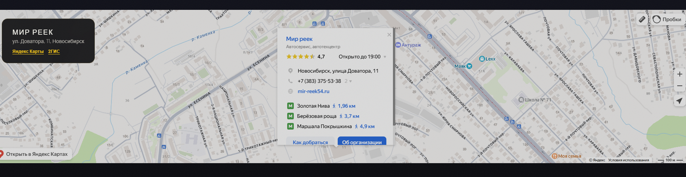

# 🔧 Мир Реек — сайт автосервиса

Коммерческий сайт-визитка для автосервиса **«Мир Реек»** (Новосибирск) — ремонт рулевых реек, ходовой и подвески.

🔗 **Сайт:** [mirreek54.ru](https://mirreek54.ru)

## Скриншоты













## О проекте

Сайт разработан для реального бизнеса — мастерской по ремонту рулевых реек в Новосибирске. Задеплоен через GitHub Pages с привязкой собственного домена.

## Возможности

- Адаптивная вёрстка (мобильные устройства, планшеты, десктоп)
- Навигация с якорными ссылками (услуги, цены, отзывы, контакты)
- Блок с прайс-листом услуг
- Раздел отзывов клиентов
- Форма записи на ремонт
- Кликабельный номер телефона для звонка с мобильного
- SEO-оптимизация (sitemap.xml, мета-теги)

## Стек технологий

| Технология | Роль |
|---|---|
| **HTML** | Разметка страницы |
| **CSS** | Стилизация и адаптивность |
| **JavaScript** | Интерактивность (меню, формы) |
| **GitHub Pages** | Хостинг и деплой |
| **Свой домен** | mirreek54.ru через CNAME |

## Деплой

Сайт развёрнут на **GitHub Pages** с привязкой домена `mirreek54.ru`.

```
MirReek54/
├── index.html       # Основная страница
├── sitemap.xml      # Карта сайта для поисковиков
├── CNAME            # Привязка домена mirreek54.ru
└── screenshots/     # Скриншоты для README
```

## Запуск локально

```bash
git clone https://github.com/Klipo07/MirReek54.git
cd MirReek54
# Открыть index.html в браузере
```

## Автор

**Огарков Кирилл Алексеевич** — [GitHub](https://github.com/Klipo07)
